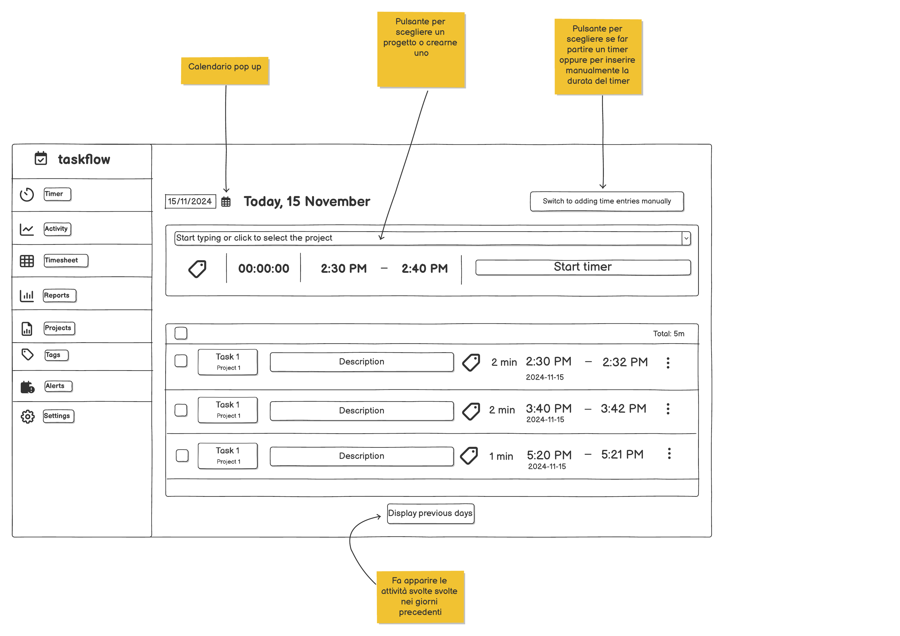
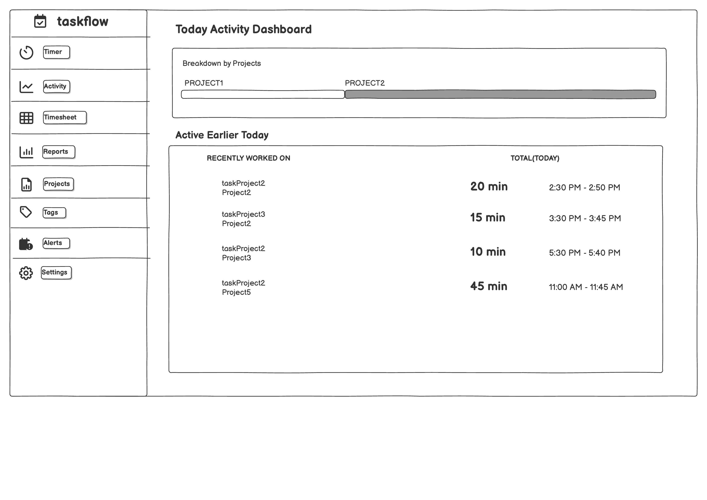
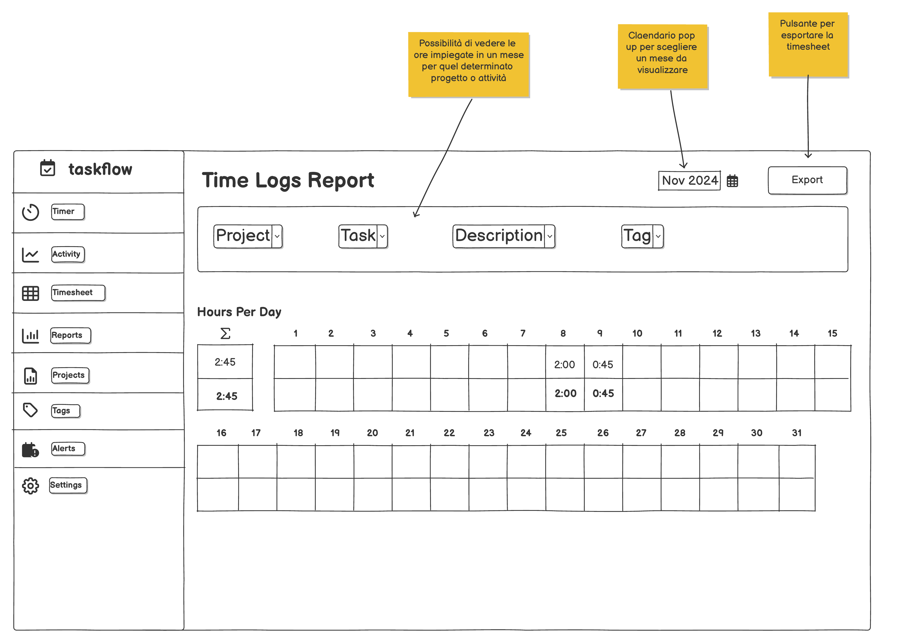
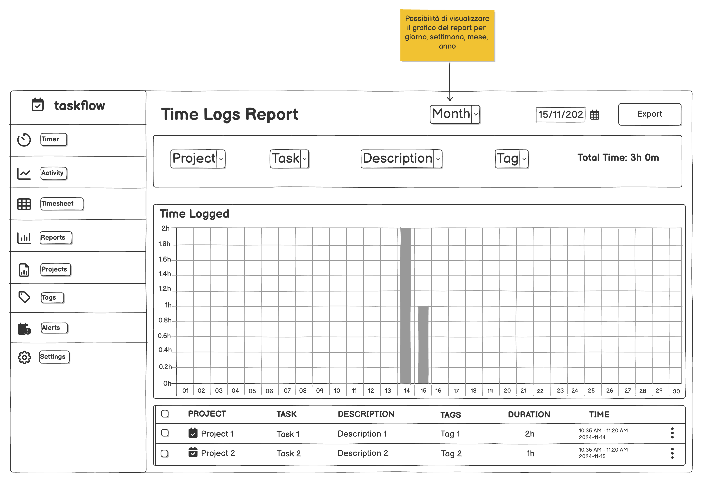
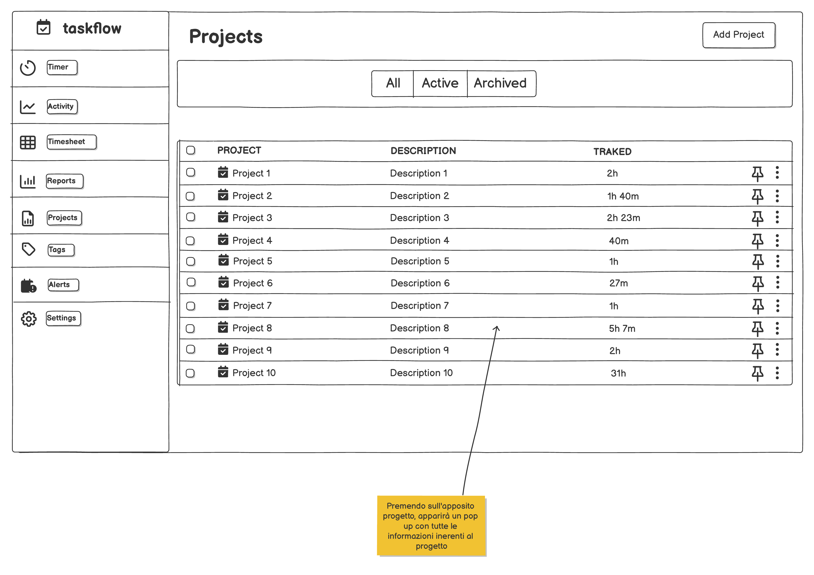
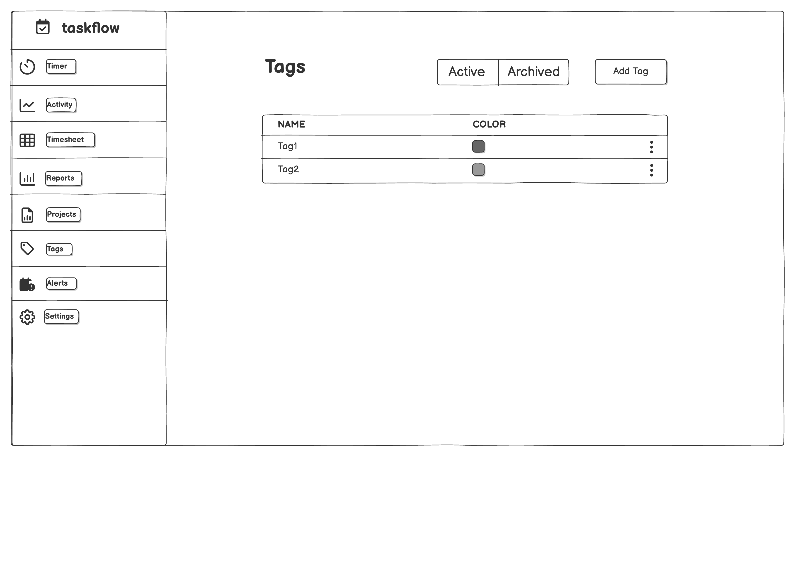
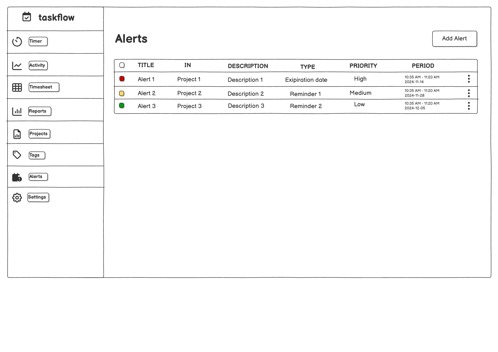
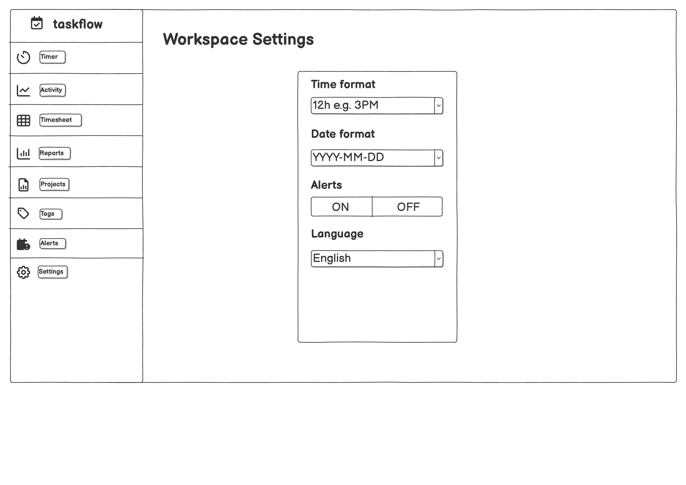

# TaskFlow - Job Activity Tracker

## Wireframe UI
Here you can find the screen designs:

| Screen | PNG | PDF |
|--------|-----|-----|
| **Home** |  | [PDF](docs/wireframes/pdf/wireframe-home.pdf) |
| **Activity** |  | [PDF](docs/wireframes/pdf/wireframe-activity.pdf) |
| **Timesheet** |  | [PDF](docs/wireframes/pdf/wireframe-timesheet.pdf) |
| **Reports** |  | [PDF](docs/wireframes/pdf/wireframe-reports.pdf) |
| **Projects** |  | [PDF](docs/wireframes/pdf/wireframe-projects.pdf) |
| **Tags** |  | [PDF](docs/wireframes/pdf/wireframe-tags.pdf) |
| **Alerts** |  | [PDF](docs/wireframes/pdf/wireframe-alerts.pdf) |
| **Settings** |  | [PDF](docs/wireframes/pdf/wireframe-settings.pdf) |
